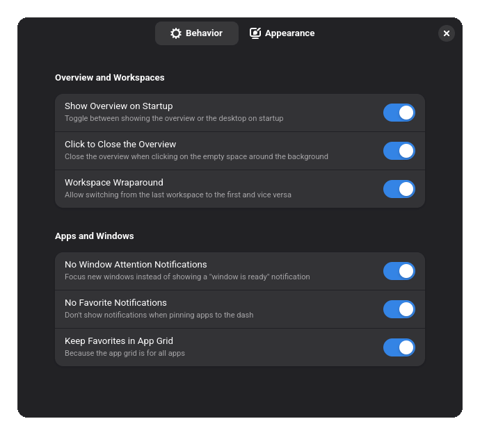

# Essential Tweaks
A GNOME Shell extension that allows you to tweak some annoying defaults and
enable quality of life features. It also aims to reduce the time spent
searching for compatible extensions when setting up a new system or after
updating GNOME.

## Attributions
This extension partially contains code adapted from the following projects:

- Click to Close Overview by l3nn4rt\
  https://github.com/l3nn4rt/click-to-close-overview

- Grand Theft Focus by zalckos\
  https://github.com/zalckos/GrandTheftFocus

- Just Perfection by Javad Rahmatzadeh\
  https://gitlab.gnome.org/jrahmatzadeh/just-perfection

- Pinned Apps in App Grid by Bruno Silva\
  https://github.com/brunos3d/pinned-apps-in-appgrid

- Panel Corners by Aurélien Hamy\
  https://github.com/aunetx/panel-corners
